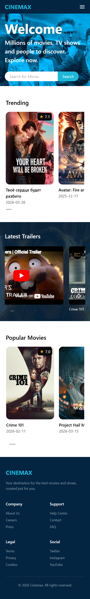
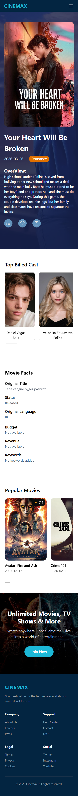

# 🎬 Movie App (React + TMDB API)

A modern movie browsing web application built using React that allows users to explore trending movies, search for titles, and view detailed movie information including cast, trailers.

---

## 🚀 Features

- 🎥 View movie details (overview, rating, release date)  
- ▶ Watch trailers (YouTube integration)  
- 📊 Movie facts (budget, revenue, language, etc.)  
- 🎨 Clean and responsive UI using Tailwind CSS  

---

## 🛠️ Tech Stack

- **Frontend:** React.js  
- **Styling:** Tailwind CSS  
- **Routing:** React Router DOM  
- **API:** TMDB (The Movie Database API)  

---

## 📡 API Used

- Popular movies → `/movie/popular`  
- Movie Details → `/movie/{id}`  
- Trailers → `/movie/{id}/videos`  
- Cast → `/movie/{id}/credits`  

---

## 📸 Screenshots

